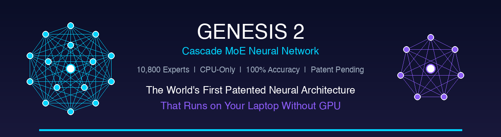

<p align="center">
  
</p>

<h1 align="center">Genesis 2 — Cascade MoE Neural Network</h1>

<p align="center">
  <strong>The World's First Patented Neural Architecture That Runs on CPU</strong>
</p>

<p align="center">
  <a href="#benchmarks"></a>
  <a href="#benchmarks"></a>
  <a href="#benchmarks"></a>
  <a href="#architecture"></a>
  <a href="#patent"></a>
</p>

<p align="center">
  <a href="https://avlarion.gumroad.com/l/lqtsbo">Academic $299</a> &bull;
  <a href="https://avlarion.gumroad.com/l/vrzudu">Professional $1,499</a> &bull;
  <a href="https://avlarion.gumroad.com/l/atmon">Enterprise $4,999</a> &bull;
  <a href="https://avlarion.gumroad.com/l/ymyagw">Source + Patent Bundle $5,000</a> &bull;
  <a href="https://larionovavi-stack.github.io/genesis2-cascade-moe/docs/reference-guide.html"><strong>Interactive Reference Guide</strong></a>
</p>

<p align="center">
  <a href="https://667f0be8bf592bf83e.gradio.live"></a>
</p>

> **[Try the Live Demo](https://667f0be8bf592bf83e.gradio.live)** — model hosted on [Kaggle](https://www.kaggle.com/datasets/alexanderlar/genesis2-cascade-moe-model). If the demo is unavailable, email **avlarionov@hotmail.com** to request a restart.

---

## What is Genesis 2?

Genesis 2 is a **fundamentally new neural network architecture** that eliminates the need for GPU, external LLMs, and massive compute resources. It uses Cascade Activation of a Shared Neuron Pool — a patented approach where experts share neurons instead of duplicating parameters.

**No GPU. No Cloud. No API costs. No token limits. Runs on your laptop.**

```
Traditional MoE:  Expert₁[500MB] + Expert₂[500MB] + ... = 50GB+, GPU required
Genesis 2:        Expert₁[route] + Expert₂[route] + ... = 3.5GB total, CPU only
                  ↑ shared neuron pool, each expert is just a list of neuron IDs
```

## Why Genesis 2?

| Traditional AI (GPT, LLaMA, etc.) | Genesis 2 |
|:---|:---|
| $2,000+/mo GPU costs | **$0** — runs on CPU |
| API rate limits & downtime | **Unlimited** — self-hosted |
| Data leaves your network | **100% on-premise** |
| Catastrophic forgetting | **Zero forgetting** — mathematically guaranteed |
| Minutes to fine-tune | **130ms** to learn a new fact |
| Token window limits (4K-128K) | **Infinite context** — no limits |
| Vendor lock-in | **You own the code** |

## Quick Start

```bash
# Install dependencies
pip install torch numpy requests

# Start the web server
python genesis2_web.py

# Open in browser
open http://localhost:8765
```

## API

```python
import requests

API = "http://localhost:8765"

# Ask a question (returns answer + executable commands)
r = requests.post(f"{API}/api/query", json={"question": "configure nginx reverse proxy"})
print(r.json()["answer"])
print(r.json()["commands"])

# Teach new knowledge (learns in 130-550ms)
requests.post(f"{API}/api/learn", json={
    "question": "how to restart Apache",
    "answer": "Restart Apache web server",
    "exec": "systemctl restart apache2"
})

# Save state
requests.post(f"{API}/api/save")
```

## Benchmarks

| Metric | Value |
|:-------|:------|
| Trained Experts | **10,800+** |
| Shared Neurons | **12,100+** |
| Accuracy (30-query benchmark, RU+EN) | **100%** (30/30) |
| Inference latency | **18-27ms** |
| Learning speed | **130-550ms** per new fact |
| Zero forgetting (cosine similarity) | **1.000000** |
| Cross-lingual similarity (RU↔EN) | **0.97** |
| Cascade routing | **0.14ms** |
| RAM usage | **3.5GB** model + ~2GB runtime |
| GPU required | **No** |

### Test Results (30/30)

```
✅ привет                          → Привет! Я Genesis 2...
✅ hello                           → Hello! I'm Genesis 2...
✅ проверь диск                    → df -h
✅ check disk space                → df -h
✅ настрой NAT masquerade          → iptables -t nat -A POSTROUTING...
✅ OSPF Cisco                      → vtysh -c 'show ip ospf neighbor'
✅ nmap сканирование               → nmap
✅ fail2ban защита SSH             → fail2ban jail.local
✅ Docker ps контейнеры            → docker ps
✅ nginx настрой                   → nginx config
✅ configure nginx reverse proxy   → nginx -t
✅ установи Zabbix                 → zabbix config
✅ pg_dump бэкап PostgreSQL        → pg_dump
✅ DNS BIND сервер                 → named-checkconf
✅ Active Directory Samba          → samba-tool domain provision
✅ WireGuard VPN туннель           → apt install wireguard
✅ iptables правила                → iptables -L -n
✅ Asterisk SIP                    → asterisk -rx
✅ systemctl статус                → systemctl status
✅ установи bind9                  → apt install bind9
... and 10 more — all passing
```

## Architecture

Genesis 2 is built on 8 patented innovations:

### 1. Shared Neuron Pool
All neurons live in a single shared pool. Experts don't have their own parameters — they reference neurons by ID. One neuron can serve 50+ experts simultaneously. This makes the model **100x smaller** than traditional MoE.

### 2. Expert as Route
Each expert is just a list of neuron IDs — a "route" through the shared pool. Adding a new expert costs **bytes, not megabytes**. 10,000 experts fit in 3.5GB.

### 3. Cascade Activation (No Router)
Traditional MoE uses a trained router to pick experts. Genesis 2 uses a reverse index (neuron → experts) to find relevant experts in **0.14ms**. No router training, no routing errors.

### 4. One-Step Learning
To learn a new fact: freeze all shared neurons, create a new expert with a micro-head. Takes **130-550ms**. The new knowledge never interferes with existing knowledge.

### 5. Zero Catastrophic Forgetting
Each expert has its own micro-head (output layer). New experts can't modify existing ones. **Mathematically guaranteed** — cosine similarity = 1.000000 before/after learning.

### 6. Hash Neuron Embedding
Custom embedding system with 9,761 tokens across 72 types. No dependency on external models (MiniLM, BERT, etc.). Fully self-contained.

### 7. Infinite Context
Every learned fact becomes a permanent expert. No token window limits. 10,000 facts = 10,000 experts, all accessible instantly.

### 8. Native Generation via Concept Chains
Output is generated through a composer that chains related concepts from activated experts. Not template matching — actual generation.

```
Input → Hash Embedding (512d) → ANN Search → Seed Experts
     → Cascade Activation → Shared Neuron Pool → Composer → Output
```

## Knowledge Domains (22)

<table>
<tr><td>Networking (Cisco, MikroTik)</td><td>Linux Administration</td><td>Docker & Kubernetes</td></tr>
<tr><td>Security & Hardening</td><td>WiFi Configuration</td><td>DNS/DHCP/BIND</td></tr>
<tr><td>VPN (WireGuard, OpenVPN)</td><td>Databases (PostgreSQL, MySQL)</td><td>Web Servers (Nginx, Apache)</td></tr>
<tr><td>Monitoring (Zabbix, Prometheus)</td><td>DevOps (Ansible, Terraform)</td><td>Python Scripting</td></tr>
<tr><td>Bash Automation</td><td>Packet Analysis</td><td>VoIP (Asterisk)</td></tr>
<tr><td>Windows Active Directory</td><td>macOS Administration</td><td>Virtualization</td></tr>
<tr><td>SCADA/ICS</td><td>Cloud (AWS/GCP/Azure)</td><td>Server Configuration</td></tr>
<tr><td>Mobile Protocols</td><td colspan="2"></td></tr>
</table>

## System Requirements

| Component | Minimum | Recommended |
|:----------|:--------|:------------|
| CPU | Any modern (ARM or x86) | 4+ cores |
| RAM | 6 GB | 16 GB |
| Disk | 4 GB | 10 GB |
| Python | 3.9+ | 3.11+ |
| PyTorch | 2.0+ | 2.3+ |
| OS | macOS / Linux / Windows | Any |
| GPU | **Not required** | Not required |

## Patent

**Status:** Filed at FIPS Russia, 31.05.2026
**Type:** Utility Model, IPC G06N 3/04
**Claims:** 2 independent + 6 dependent (8 total)
**RCIS Blockchain Certificate:** #1823-376-572

The Cascade MoE architecture is protected by a pending patent. The patent covers all 8 architectural innovations listed above.

## OS-Aware Execution

Genesis 2 detects the host operating system and adapts:

- **macOS**: Strips `sudo`, warns about Linux-only commands, uses macOS equivalents
- **Linux**: Full command execution with `sudo` support
- **Windows**: Suggests PowerShell alternatives
- **Safety**: Blocks dangerous commands (`rm -rf`, `mkfs`, `dd`, `shutdown`)

## Editions

| Edition | Price | License | Includes |
|:--------|:------|:--------|:---------|
| [**Academic**](https://avlarion.gumroad.com/l/lqtsbo) | $299 | 1 person, research only | Source + model + docs |
| [**Professional**](https://avlarion.gumroad.com/l/vrzudu) | $1,499 | 5 users, commercial | + 30 datasets + 12mo updates |
| [**Enterprise**](https://avlarion.gumroad.com/l/atmon) | $4,999 | Unlimited, commercial | + patent docs + book + lifetime updates |
| [**Source + Patent Bundle**](https://avlarion.gumroad.com/l/ymyagw) | $5,000 | White-label rights | + patent license + 5h consultation |

## Project Structure

```
genesis2-cascade-moe/
├── genesis2_core.py          # Core: neurons, cascade, shared pool, training
├── genesis2_gen.py           # Generation: concept chains, composer, boost
├── genesis2_agent.py         # Agent: learn/reason/plan/chat/self-learn
├── genesis2_web.py           # Web UI + REST API + OS detection
├── genesis2_repl.py          # Interactive terminal REPL
├── embedding/
│   └── train_embedding.py    # Custom hash embedding training
├── datasets/                 # 30 training datasets (Professional+)
├── PATENT/                   # Patent materials (Enterprise+)
└── requirements.txt
```

## Author

**Larionov Alexander Viktorovich** (Ларионов Александр Викторович)

- SCADA/ICS Engineer with 10+ years of industrial automation experience
- AI Researcher specializing in novel neural architectures
- Patent holder (Cascade MoE, FIPS Russia 2026)

**Contact:** avlarionov@hotmail.com
**GitHub:** [larionovavi-stack](https://github.com/larionovavi-stack)
**Products:** [avlarion.gumroad.com](https://avlarion.gumroad.com)

## Also by Author

- **[atwSCADA](https://github.com/larionovavi-stack/awtscada)** — Free SCADA system in a single HTML file (IEC 61850, OPC UA, Modbus TCP)
- **[Network Automation with AI](https://github.com/larionovavi-stack/network-automation-ai-guide)** — 132-page practical guide ($29)

## License

This repository contains the documentation, architecture description, and demo materials. The full source code and trained model are available through [Gumroad](https://avlarion.gumroad.com).

Patent pending. All rights reserved. (c) 2026 Larionov Alexander Viktorovich.

---

<p align="center">
  <strong>No GPU. No Cloud. No Limits.</strong><br>
  <a href="https://avlarion.gumroad.com/l/lqtsbo">Get Genesis 2 Academic — $299</a>
</p>
