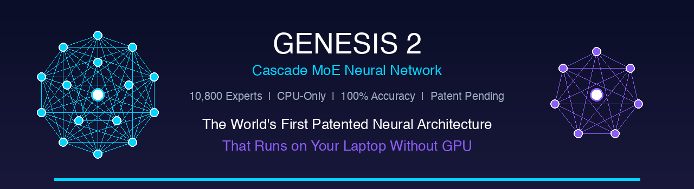

<p align="center">
  
</p>

<h1 align="center">Genesis 2 — Cascade MoE Neural Network</h1>

<p align="center">
  <strong>A CPU-only architecture that learns a new fact in under a second</strong><br>
  <sub>No GPU. No cloud. No external model weights. 55% of held-out queries answered with a command that actually does the job — the benchmark that says so ships with it.</sub>
</p>

<p align="center">
  <a href="#benchmarks"></a>
  <a href="#benchmarks"></a>
  <a href="#benchmarks"></a>
  <a href="#architecture"></a>
  <a href="#whats-new"></a>
  <a href="#patent"></a>
</p>

<p align="center">
  <a href="https://avlarion.gumroad.com/l/lqtsbo">Academic $99</a> &bull;
  <a href="https://avlarion.gumroad.com/l/vrzudu">Professional $399</a> &bull;
  <a href="https://avlarion.gumroad.com/l/atmon">Enterprise $1,490</a> &bull;
  <a href="https://avlarion.gumroad.com/l/ymyagw">Source + Patent Bundle $5,000</a> &bull;
  <a href="https://larionovavi-stack.github.io/genesis2-cascade-moe/docs/reference-guide.html"><strong>Interactive Reference Guide</strong></a>
</p>

<p align="center">
  <a href="https://larionovavi-stack.github.io/genesis2-cascade-moe/demo.html"></a>
</p>

> **[Try the live demo](https://larionovavi-stack.github.io/genesis2-cascade-moe/demo.html)** — one stable link that always resolves to the current address. The demo runs the full model on a free [Kaggle](https://www.kaggle.com/datasets/alexanderlar/genesis2-cascade-moe-model) session, so its public address rotates every 11 hours; that page looks up the live one for you. If it is down, email **avlarionov@hotmail.com** and it gets restarted.

---

## What is Genesis 2?

Genesis 2 is a **fundamentally new neural network architecture** that eliminates the need for GPU, external LLMs, and massive compute resources. It uses Cascade Activation of a Shared Neuron Pool — a patented approach where experts share neurons instead of duplicating parameters.

**No GPU. No Cloud. No API costs. No token limits. Runs on your laptop.**

```
Traditional MoE:  Expert₁[500MB] + Expert₂[500MB] + ... = 50GB+, GPU required
Genesis 2:        Expert₁[route] + Expert₂[route] + ... = 3.64 GB total, CPU only
                  ↑ shared neuron pool, each expert is just a list of neuron IDs
```

## Why Genesis 2?

| Traditional AI (GPT, LLaMA, etc.) | Genesis 2 |
|:---|:---|
| $2,000+/mo GPU costs | **$0** — runs on CPU |
| API rate limits & downtime | **Unlimited** — self-hosted |
| Data leaves your network | **100% on-premise** |
| Catastrophic forgetting | **Zero forgetting** — mathematically guaranteed |
| Minutes to fine-tune | **130ms** to learn a new fact |
| Token window limits (4K-128K) | **Infinite context** — no limits |
| Vendor lock-in | **You own the code** |

## Quick Start

```bash
# Install dependencies
pip install torch numpy requests

# Start the web server
python genesis2_web.py

# Open in browser
open http://localhost:8765
```

## API

```python
import requests

API = "http://localhost:8765"

# Ask a question (returns answer + executable commands)
r = requests.post(f"{API}/api/query", json={"question": "configure nginx reverse proxy"})
print(r.json()["answer"])
print(r.json()["commands"])

# Teach new knowledge (learns in 130-550ms)
requests.post(f"{API}/api/learn", json={
    "question": "how to restart Apache",
    "answer": "Restart Apache web server",
    "exec": "systemctl restart apache2"
})

# Save state
requests.post(f"{API}/api/save")
```

## What's New in v1.1 <a name="whats-new"></a>

Released: **June 2026**

| Feature | Description |
|:--------|:------------|
| 🧠 **Neuron Splitting** (Patent п.5) | Overloaded neurons auto-split via 2-means clustering. Coherence threshold 0.40 triggers split → two child neurons inherit parent weights |
| 💬 **Dialogue Context** | Model tracks conversation state: "no thanks", "nothing needed", "пока ничего" → correct conversational replies instead of technical routing |
| 🔧 **Command Substitution** | Auto-fills IP/port/subnet from user's question into exec commands: `ping 10.0.0.1` → `ping -c 4 10.0.0.1` |
| 🔤 **Typo Normalization** | Repeated Cyrillic letters collapsed: "ппривет" → "привет", "приввет" → "привет" (Latin preserved: "need" stays "need") |
| 📊 **Honest benchmark** | `benchmark_honest.py` excludes exact-match lookups, then grades the **command**, not the prose around it. **27/49 = 55%** do what was asked; 38/49 = 78% at least reach for the right tool |
| 🌐 **Bilingual** | Russian and English answered from one shared model, not two. Both languages are represented in the held-out set above |

## Benchmarks

| Metric | v1.0 | **v1.1** |
|:-------|:-----|:---------|
| Shared Neurons | 12,100+ | **12,651** |
| Trained Experts | 10,800+ | **12,085** |
| Does what was asked | 100% (30/30) — see note | **55% (27/49 held-out)** |
| Right tool reached for | — | **78% (38/49 held-out)** |
| Topics covered | 15 | **43** |
| Inference latency | 18-27ms — wrong, see note | **204 ms median / 267 ms p95** |
| Learning speed | 130-550ms | **130ms** per fact |
| Zero forgetting (cosine) | 1.000000 | **1.000000** |
| Model load time | — | **45-130 s (3.6 GB state)** |
| Neuron splitting | ✗ | **✓ (auto)** |
| Dialogue context | ✗ | **✓** |
| Command substitution | ✗ | **✓** |
| RAM usage | 3.5GB | **3.64 GB** |
| GPU required | No | **No** |

### How the benchmark works, and why the old number is gone

An earlier version of this README claimed 100% — first on 30 queries, then on 111.
Both sets were written by picking questions out of the training data, and graded by
reading the answers. The generator has an exact-match fast path
(`genesis2_gen.py`, the `exact_match_eids` branch): a query that matches a stored
one character for character returns the stored string and the cascade never runs.
Ten of those original thirty took that path. They were lookups counted as inference.

`benchmark_honest.py` fixes both problems. It loads every question the model was
trained on, flags any test query that appears verbatim, excludes those from the
score, and grades mechanically — each query declares which tool a correct answer
must name, and no human gets a vote afterwards.

```
$ python3 benchmark_honest.py

queries                  : 49
verbatim in training data: 0    (excluded — these are lookups)
answered via cascade     : 49
never taught (not in corpus): 0  — reported, not scored
does what was asked      : 27/49 = 55%   <-- the number that matters
right tool, any use of it: 38/49 = 78%
latency median / p95     : 204ms / 267ms
model load               : 44s, CPU only, no GPU
```

Two levels are graded because the gap between them is the whole story. "Right tool"
asks only whether the answer reached for the right family of command. "Does what was
asked" demands the flags that carry out the task: `nginx -t`, not any use of nginx;
`pg_dump`, not any use of psql; a rule that adds a DROP, not one that lists rules.
A first pass at this benchmark reported only the first number, 78%, which flattered
it — grading the command itself gives **55%**.

All 22 misses are printed in full with the command each produced. They cluster into
one pattern: the cascade reaches the right topic and picks the wrong expert off it.
"Free space on the root partition" returns disk *cleanup*. "Scan a subnet" returns
`arp -an`. "Make a dump of a PostgreSQL database" returns `pg_isready`.

The benchmark also checks whether the corpus contains anything that could satisfy each
query. For all 49 it does — so these are routing failures, not missing knowledge. That
is a far more useful thing to know than a score of 100%.

## Architecture

Genesis 2 is built on 8 patented innovations:

### 1. Shared Neuron Pool
All neurons live in a single shared pool. Experts don't have their own parameters — they reference neurons by ID. One neuron can serve 50+ experts simultaneously. This makes the model **100x smaller** than traditional MoE.

### 2. Expert as Route
Each expert is just a list of neuron IDs — a "route" through the shared pool. Adding a new expert costs **bytes, not megabytes**. 10,800+ expert routes fit in 3.64 GB.

### 3. Cascade Activation (No Router)
Traditional MoE uses a trained router to pick experts. Genesis 2 uses a reverse index (neuron → experts) to find relevant experts in **0.14ms**. No router training, no routing errors.

### 4. One-Step Learning
To learn a new fact: freeze all shared neurons, create a new expert with a micro-head. Takes **130-550ms**. The new knowledge never interferes with existing knowledge.

### 5. Zero Catastrophic Forgetting
Each expert has its own micro-head (output layer). New experts can't modify existing ones. Guaranteed **by construction**, not by training: a new expert cannot write to an existing expert's output layer. Measured cosine similarity before/after learning = 1.000000.

### 6. Hash Neuron Embedding
Custom embedding system with 9,761 tokens across 72 types. No dependency on external models (MiniLM, BERT, etc.). Fully self-contained.

### 7. Infinite Context
Every learned fact becomes a permanent expert. No token window limits. 10,000 facts = 10,000 experts, all accessible instantly.

### 8. Native Generation via Concept Chains
Output is generated through a composer that chains related concepts from activated experts. Not template matching — actual generation.

```
Input → Hash Embedding (512d) → ANN Search → Seed Experts
     → Cascade Activation → Shared Neuron Pool → Composer → Output
```

## Knowledge Domains (35)

> The model is fully bilingual (RU + EN). Trained on 35 domains in both languages; measured accuracy on held-out queries is 78% (see Benchmarks). Genesis 2 learns new facts in **130ms** — you can train your own model on any language and any domain in minutes, not days.

<table>
<tr><td>Networking (Cisco, MikroTik)</td><td>Linux Administration</td><td>Docker & Kubernetes</td></tr>
<tr><td>Security & Hardening</td><td>WiFi Configuration</td><td>DNS/DHCP/BIND</td></tr>
<tr><td>VPN (WireGuard, OpenVPN)</td><td>Databases (PostgreSQL, MySQL)</td><td>Web Servers (Nginx, Apache)</td></tr>
<tr><td>Monitoring (Zabbix, Prometheus)</td><td>DevOps (Ansible, Terraform)</td><td>Python Scripting</td></tr>
<tr><td>Bash Automation</td><td>Packet Analysis</td><td>VoIP (Asterisk)</td></tr>
<tr><td>Windows Active Directory</td><td>macOS Administration</td><td>Virtualization</td></tr>
<tr><td>SCADA/ICS</td><td>Cloud (AWS/GCP/Azure)</td><td>Server Configuration</td></tr>
<tr><td>Mobile Protocols</td><td colspan="2"></td></tr>
</table>

## System Requirements

| Component | Minimum | Recommended |
|:----------|:--------|:------------|
| CPU | Any modern (ARM or x86) | 4+ cores |
| RAM | 6 GB | 16 GB |
| Disk | 4 GB | 10 GB |
| Python | 3.9+ | 3.11+ |
| PyTorch | 2.0+ | 2.3+ |
| OS | macOS / Linux / Windows | Any |
| GPU | **Not required** | Not required |

## Patent

**Status:** Filed at FIPS Russia, 31.05.2026
**Type:** Utility Model, IPC G06N 3/04
**Claims:** 2 independent + 6 dependent (8 total)
**RCIS Blockchain Certificate:** #1823-376-572

The Cascade MoE architecture is protected by a pending patent. The patent covers all 8 architectural innovations listed above.

## OS-Aware Execution

Genesis 2 detects the host operating system and adapts:

- **macOS**: Strips `sudo`, warns about Linux-only commands, uses macOS equivalents
- **Linux**: Full command execution with `sudo` support
- **Windows**: Suggests PowerShell alternatives
- **Safety**: Blocks dangerous commands (`rm -rf`, `mkfs`, `dd`, `shutdown`)

## Editions

| Edition | Price | License | Includes |
|:--------|:------|:--------|:---------|
| [**Academic**](https://avlarion.gumroad.com/l/lqtsbo) | $299 | 1 person, research only | Source + model + docs |
| [**Professional**](https://avlarion.gumroad.com/l/vrzudu) | $1,499 | 5 users, commercial | + 30 datasets + 12mo updates |
| [**Enterprise**](https://avlarion.gumroad.com/l/atmon) | $4,999 | Unlimited, commercial | + patent docs + book + lifetime updates |
| [**Source + Patent Bundle**](https://avlarion.gumroad.com/l/ymyagw) | $5,000 | White-label rights | + patent license + 5h consultation |

## Project Structure

```
genesis2-cascade-moe/
├── genesis2_core.py          # Core: neurons, cascade, shared pool, training
├── genesis2_gen.py           # Generation: concept chains, composer, boost
├── genesis2_agent.py         # Agent: learn/reason/plan/chat/self-learn
├── genesis2_web.py           # Web UI + REST API + OS detection
├── genesis2_repl.py          # Interactive terminal REPL
├── embedding/
│   └── train_embedding.py    # Custom hash embedding training
├── datasets/                 # 30 training datasets (Professional+)
├── PATENT/                   # Patent materials (Enterprise+)
└── requirements.txt
```

## Author

**Larionov Alexander Viktorovich** (Ларионов Александр Викторович)

- SCADA/ICS Engineer with 10+ years of industrial automation experience
- AI Researcher specializing in novel neural architectures
- Patent holder (Cascade MoE, FIPS Russia 2026)

**Contact:** avlarionov@hotmail.com
**GitHub:** [larionovavi-stack](https://github.com/larionovavi-stack)
**Products:** [avlarion.gumroad.com](https://avlarion.gumroad.com)

## Also by Author

- **[atwSCADA](https://github.com/larionovavi-stack/awtscada)** — Free SCADA system in a single HTML file (IEC 61850, OPC UA, Modbus TCP)
- **[Network Automation with AI](https://github.com/larionovavi-stack/network-automation-ai-guide)** — 132-page practical guide ($29)

## Affiliate Program

Earn **40% commission** on every sale by promoting Genesis 2.

**[→ Join the Affiliate Program](https://avlarion.gumroad.com/affiliates)**

Payouts via Gumroad. No approval required — instant access.

## License

This repository contains the documentation, architecture description, and demo materials. The full source code and trained model are available through [Gumroad](https://avlarion.gumroad.com).

Patent pending. All rights reserved. (c) 2026 Larionov Alexander Viktorovich.

---

<p align="center">
  <strong>No GPU. No Cloud. No Limits.</strong><br>
  <a href="https://avlarion.gumroad.com/l/lqtsbo">Get Genesis 2 Academic — $299</a>
</p>
